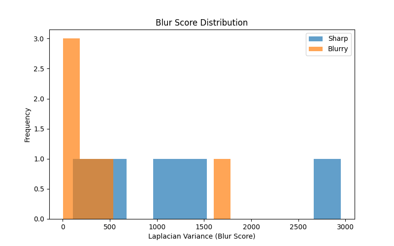
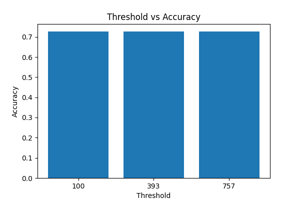
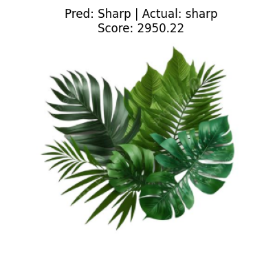
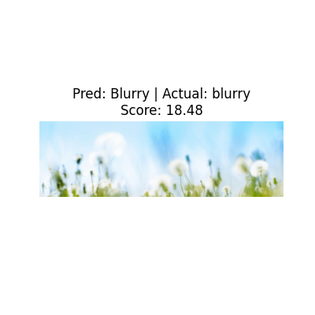
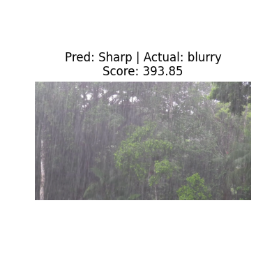

# 🔍 Blur Detection using Laplacian Variance

## 📌 Overview

This project implements an image quality assessment pipeline to detect blur using Laplacian variance in Python with OpenCV. The goal was to explore how effectively edge-based metrics can identify blurred images and to evaluate their robustness across different image types.

The project simulates a simplified version of quality control systems used in large-scale imaging workflows, such as digital pathology.

---

## ⚙️ Methodology

### 1. Preprocessing

* Images are loaded and converted to grayscale
* This reduces dimensionality and isolates intensity-based features

### 2. Blur Detection

* The Laplacian operator is applied to detect edges
* The **variance of the Laplacian** is used as a blur score:

  * Low variance → fewer edges → blurry image
  * High variance → more edges → sharp image

### 3. Classification

* Images are classified as **Sharp** or **Blurry** based on a threshold
* Multiple thresholding strategies were explored:

  * Fixed threshold
  * Mean-based threshold
  * Median-based threshold

---

## 📊 Evaluation

A labelled dataset was created manually to simulate ground truth.

### Results

| Threshold | Method       | Accuracy |
| --------- | ------------ | -------- |
| 100       | Fixed        | 0.73     |
| 393       | Median-based | 0.73     |
| 757       | Mean-based   | 0.73     |

---

## 📈 Visual Analysis

### Blur Score Distribution

* Histograms show overlap between sharp and blurry image scores
* Indicates that Laplacian variance does not perfectly separate the classes

### Threshold Comparison

* Accuracy remains constant across thresholds
* Suggests performance is limited by the feature, not threshold selection

### Example Predictions

* Visual outputs highlight correct and incorrect classifications
* Helps identify patterns in model failure cases

---

## 📊 Example Outputs

### Blur Score Distribution

### Threshold Comparison

### Example Predictions

---

## 🔍 Key Findings

* Laplacian variance is effective for detecting **obvious blur**
* Performance degrades on **textured images** (e.g. foliage, landscapes)
* Threshold tuning alone does not significantly improve accuracy
* Blur detection is sensitive to **image content and structure**

---

## ⚠️ Limitations

* **Texture sensitivity**: High-frequency textures can produce high variance even in blurry images
* **Label ambiguity**: Some images fall between “sharp” and “blurry”, making ground truth subjective
* **Feature limitation**: Laplacian captures edge intensity, not perceptual clarity

---

## 🧠 Key Insight

There is a mismatch between **human perception of blur** and **edge-based mathematical metrics**.
This suggests that more advanced approaches (e.g. multi-feature methods or learned models) are required for robust blur detection.

---

## 🚀 Future Work

* Combine multiple edge detectors (e.g. Sobel + Laplacian)
* Train a simple machine learning classifier
* Apply the method to microscopy or histology datasets
* Explore perceptual blur metrics

---

## 🛠️ Technologies Used

* Python
* OpenCV
* NumPy
* Matplotlib

---

## 💡 Motivation

This project was developed to explore image quality assessment techniques relevant to real-world applications such as digital pathology, where detecting artefacts like blur is critical for ensuring reliable analysis.

---
